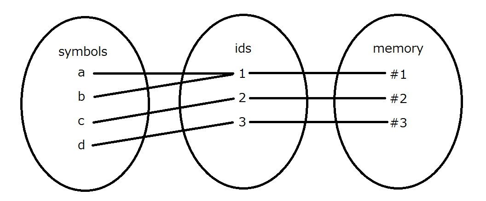

# Index
 - [Context application](#context-application)
 - [Object control](#object-control)
 - [Object initialization](#object-initialization)
     - [Create a basic object](#create-a-basic-object)
     - [Configure the basic object](#configure-the-basic-object)
 - [Order of function](#order-of-function)
     - [Bounding](#bounding)
     - [Freeing](#freeing)
 - [Comment](#comment)
 - [Substitution](#substitution)
     - [Normal substitution](#normal-substitution)
     - [Constant substitution](#constant-substitution)
 - [Special symbols](#special-symbols)
     - [\`_\` symbol](#`_`-symbol)
 - [Function application](#function-application)
 - [Access control](#access-control)
 - [Evaluation strategy](#evaluation-strategy)
     - [Forced evaluation](#forced-evaluation)
     - [Evaluation process](#evaluation-process)
     - [Evaluable flag](#evaluable-flag)
 - [Literal values](#literal-values)
 - [Value object, Transient object and Lazy object](#value-transient-lazy)
     - [Value object](#value-object)
     - [Transient object](#transient-object)
     - [Lazy object](#lazy-object)
     - [Tips](#objects-type-tips)
 - [Symbol object](#symbol-object)
 - [Syntax definition](#syntax-definition)
     - [Keyword](#keyword)

[editing](#edit)

<a id = "context-application"></a>
# Context application
First of all, I'll show how to explain the context. I use a table in the form of the one below to represent it.

|SYMBOL||
|:-:|:-:|
|CONTEXT|ID|
|BOUND VAR LIST|EXPR|

```
>> x = a
>> y = b

*** x = a, y = b context ***
>> (x + y)	=> a + b
>> f = \z -> (x + z)
>> f c	=> a + c
```
|f||
|:-:|:-:|
|x = a|(id)|
|z|x + z|

```
>> f = fc
```

|f||
|:-:|:-:|
|x = a</br>z = c|(id)|
|z|x + z|

```
>> g = (x + z)	=> (E) `z` symbol does not exist in this context.
```

NOTE
- (E)
: an error will be thrown, which is explained by the following statement.

<a id = "object-control"></a>
# Object control
Objects are controlled by the fundamental program, which is called **runtime**. Each of them has an **object id (id)**. It is used to associate a **symbol** with an **onode** (abbr. of object node) .



**sybmol-id table**

|symbol|id|eval<sup>\*</sup>|access|const|
|:-:|:-:|:-:|:-:|:-:|
|a |1 |- |- |- |
|b |1 |- |- |- |
|c |2 |- |- |- |
|d |3 |- |- |- |
\* see [Evaluable flag](#evaluable-flag) section.

**onode table**

|id|type|address|ref count|date|
|:-:|:-:|:-:|:-:|:-:|
|1 |int |#1 |2 |- |
|2 |int |#2 |1 |- |
|3 |char|#3 |1 |- |

Each context has its own symbol-id table in order to introduce a **scope** (a context unique to each object). On the other hand, the only one onode table is assigned to each program so that the runtime can have control over all the objects in the program.

The relationship between a symbol and an id is many-to-one – multiple symbols can refer to the same id (object): in the example above, while the symbol `a` points the id `1`, `b` also the same one. 

The onode attribute **ref counter** is the number of symbols that refer to the onode (object). At the creation of an onode, its ref counter is 1. As some other symbol begins to refer to the onode, the number increases by 1. As a symbol stops to, it decreases by 1. Once it gets 0, which means no symbol has reference to the object and, therefore, the object will never be used again<sup>\*</sup>, the object is automatically detected by the runtime and registered in the **garbage collection (G.C)**. G.C periodically checks through some kind of list whether non-using objects exist, and when it detects any object that is no longer used, it free the memory space allocated to the object to extend the available space. By this system, programmers can be free from the concern about memory problems (ex. stack over flow).

\* This is because you cannot configure the symbol to set the referring id manually. Only the runtime can set the id when you define a new symbol or relate the symbol to some object.

<a id = "object-initialization"></a>
# Object initialization
In this section, I’ll explain step by step how an object create and register in the runtime.

<a id = "create-a-basic-object"></a>
## 1. Create a basic object
When you define a new object, firstly the runtime creates a basic object. The runtime automatically sets an id and an expression based on the definition.

|(basic obj)||
|:-:|:-:|
|- |(id) |
|- |(expr) |

<a id = "configure-the-basic-object"></a>
## 2. Configure the basic object
After the basic object is created, firstly, the runtime analyze the expression object, make a symbol list, in which all the symbols used in the expression are registered, and set it to the symbol-id table of the object. Every element’s id is 0 at this moment. Second, it applies the external context to the object (C.A.) – it refers to the symbol-id table of an object in which the object is defined and copies the id to the equivalent column’s id. Note that variables which are not assigned any value at the end of this operation are deleted from the symbol-id table.

|(basic obj)||
|:-:|:-:|
|(var) |(id) |
|- |(expr) |

```
(Suppose you are in x = 1 context)
>> f = {y = 2, x + y + z}   //definition
```
- 1st step

|(basic obj)||
|:-:|:-:|
|- |10 |
|- |y = 2</br>x + y + z |

- 2nd step

|(basic obj)||
|:-:|:-:|
|x = _</br>y = _</br>z = _ |10 |
|- |y = 2</br>x + y + z |

- 3rd step

|(basic obj)||
|:-:|:-:|
|x = 1</br>y = _</br>z = _ |10 |
|- |y = 2</br>x + y + z |

- 4th step

|(basic obj)||
|:-:|:-:|
|x = 1 |10 |
|- |y = 2</br>x + y + z |

<a id = "order-of-function"></a>
# Order of function (expressed as n°(order))
Each object has an **order attribute**. This indicates how many arguments the object can be applied. For example, a 1° object takes an argument, and a 0° object takes no argument. Note that this does not mean a 0° object is a value object. No matter which type the object is – value, transient or lazy – it can be 0°.

The order of a function can be changed by bounding and freeing methods.

<a id = "bounding"></a>
## Bounding
To make a free variable (default variable state) a bound one. The operation enables variables in an object to be set by being past when the object being called. It is an extension of the concept of a function and what this operation does can also be described as "to make the order of the object higher by 1". You can change the argument and dependency of an object. For example, firstly you define an object including x and y variables but not having any argument, and lately you add arguments to the object to work it properly (refer to the codes below).

```
\x. (x, y) 
Bound y.
\y, x. (x, y)
```
```
x -> (x, y)

*** bound y ***
y -> x -> (x, y)
```

\<operators\>  
- (->) : x -> (x, y)
- (<-) : (x, y) <- x

<a id = "freeing"></a>
## Freeing
To make a bound variable a free one. The operation enables variables related to parameters to be free (the inverse operation of bounding). After that, the variables are set as the objects, if any, defined in the object, or otherwise set as undefined (it is omitted from the symbol-id table). What the operation does can be described as "to make the order of the object lower by 1°". Keep it in mind that the order cannot become lower than 0°.

```
\y, x. (x, y)
Free y.
\x. (x, y)
```
```
y -> x -> (x, y)

*** free y ***
x -> (x, y)

*** free x ***
y -> (x, y)
```

\<operators\>
- (>-) : x >- (x -> (x, y))
- (-<) : (x -> (x, y)) -< x

\* `bound` and `free` are named after the lambda calculus.

<a id="function-application"></a>
# Function application
The way of applying arguments to a function is taken after Haskell. The argument list is not embraced. Suppose f is the 2 order function, `f a b` is the same as `f(a, b)` in other languages such as C or Java. The arguments are taken in the "one after another" strategy. This means every function is **curried**. And so you can partially apply arguments (this is called **partial application**). And you can also, as you know, decide what arguments to become externally designated.

```
>> f = (1 +)    // f is a value object
>> f 1      => 2

>> f = (1 + x + y)  // f is a value object
>> f = :x -> f  // x become external variable
>> f 1      => 2
```

For details, see [Order of function](#order-of-function) section.

<a id = "substitution"></a>
# Substitution
When a value or an object is substituted for a symbol, the symbol's evaluable flag is not set in any process of evaluation, which means the symbol is not evaluated in a substitutional expression.

This language has two ways of substituting – normal and constant. The left side of an equal operator must be symbol<!--(make sure this is a symbol not a symbol fobject)-->. If the right side is a value, new object is created based on the value.

<a id = "normal-substitution"></a>
## 1. Normal substitution
A simple “=” symbol is a normal substitution operator. The symbol is registered in the symbol-id table with the object’s id. If the symbol already exists and refers to something, its reference is re-set.
```
>> x = 1  	// x._id = 10
```

|symbol|id|eval|access|const|
|:-:|:-:|:-:|:-:|:-:|
|x |10 |* |- |- |

<a id = "constant-substitution"></a>
## 2. Constant substitution
A compound `:=` symbol is a constant substitution operator. The symbol is registered in the symbol-id table with the object’s id and a constant flag. If the symbol already exists and refers to something, its reference is re-set. After this operation, the symbol cannot be re-set.

```
>> x := 1  	// x._id = 10
```

|symbol|id|eval|access|const|
|:-:|:-:|:-:|:-:|:-:|
|x |10 |* |- |* |

```
>> x = 2		=> (E) x is a constant symbol
```

<a id = "comment"></a>
# Comment
You can use comments to leave some message in a source code. There is two types of comment – a single line comment and a multiple line comment. They are same as ones in C or Java. A single line comment is written after `//`. A multiple line comment begins from `/*` and end at `*/`.

```
*** single line comment ***
>> (expression) // (comment)

*** multiple line comment ***
>> (expression) /* (comment)
>> */

>> (expression) /* (comment) */
```

<a id = "special-symbols"></a>
# Special symbols
<a id = "`_`-symbol"></a>
## `_` symbol
This symbol refers to the `_` object. The runtime define the symbol and the object automatically, and you cannot re-define by yourself. `_` corresponds to `nil` or `null` in other languages. The `_` object is a special object, whose id is 0. Every object coming from this object is `_`. And though any object is assigned to `_`, `_` remains the same. You can relate a symbol to `_`. If `_` is past to the runtime, the runtime throws an error saying, `undefined`.

```
>> nil = _
>> nil.x		=> (E) undefined*
>> nil.x = 1	// substitute 1 for `_`
>> nil.x		=> (E) undefined*
```

NOTE
- `undefined`
: the `_` object is returned.

<a id = "access-control"></a>
# Access control
When you want to restrict access to an symbol, you can use access control operators. There are three type operators – `@+`, `@#`, `@-`. They are taken after UML notation. If you don't specify which control is applied to a symbol, `@+` is applied. These operators must be placed before a symbol.

- `@+` (public)  
You can access from anywhere the symbol that `@+` is applied to. The symbol is used for context application.

- `@#` (protected)  
You cannot access from outside the symbol that `@#` is applied to. The symbol is used for context application.

- `@-` (private)  
You cannot access from outside the symbol that `@-` is applied to. The symbol is not used for context application.

||outside access |context application |
|:-|:-:|:-:|
|**public**    |* |* |
|**protected** |- |* |
|**private**   |- |- |

```
>> x = 1
```
|symbol|id|eval|access|const|
|:-:|:-:|:-:|:-:|:-:|
|x |10 |* |+ |* |
```
>> @#x
```
|symbol|id|eval|access|const|
|:-:|:-:|:-:|:-:|:-:|
|x |10 |* |# |* |
```
>> @-x
```
|symbol|id|eval|access|const|
|:-:|:-:|:-:|:-:|:-:|
|x |10 |* |- |* |
```
>> @+x
```
|symbol|id|eval|access|const|
|:-:|:-:|:-:|:-:|:-:|
|x |10 |* |+ |* |

The access control operator is placed like `$` operator.
```
*** placed like a part of an object (recommended) ***
>> @+x = 1
>> @-x

*** placed like a function ***
>> @+ x = 1
>> @- x
```

```
>> obj = {x = 1, @+y = 2, @# z = 3, @- w = 4}
>> obj.x    => 1
>> obj.y    => 2
>> obj.z    => (E) access denied
>> obj.w    => (E) access denied

>> @+(1 + 1)    => (E) (1 + 1) is not a symbol
>> @-:x         => (E) :x is not a symbol

>> x = 1
>> @+y = 2
>> @#z = 3
>> @-w = 4
>> obj = {`(x, y, z, w)}
>> $(obj)   => `(1, 2, 3, `_`)
>> obj.x    => 1
>> obj.y    => 2
>> obj.z    => (E) access denied
>> obj.w    => (E) access denied
>> @+w
>> obj.w    => (E) access denied
>> obj = {`(x, y, z, w)}
>> obj.w    => 4
```

<a id = "evaluation-strategy"></a>
# Evaluation strategy
The program written in this language is evaluated from top to down, expression by expression, when it is running, that is, in the form of **interpret**.

```
>> x    => (E) undefined
>> x = 1
>> x    => 1
>>      => (E) undefined
```

Expressions are recursively evaluated – until there is no **evaluable expression**<sup>\*</sup>. <!-- The evaluation starts from the expression with the highest priority and in the most left side, then to the right, to one that with the second highest in the most left, to the right… --> In this language, **leftmost outsidemost (call-by-name) strategy** is adopted (as well as Haskell).

\* evaluable expression
: an object whose evaluable flag is set

Every expression returns either a literal value or an object.

The symbol is replaced with an object which it points, unless it is a left hand value (placed at the left side of an equal type operator). The unbraced transient type object and the raw expression are evaluated. 

The expressions that are surrounded with round brackets are evaluated with priority. In fact, they are value objects and they "virtually" do with priority.

```
*** leftmost evaluation ***
>> (1 + 1) * (1 + 1)	=> 2 * (1 + 1) => (2 *) (1 + 1) => (2 *) 2 => 4
>> x = [1 + 1]
>> x * (1 + 1)	=> (1 + 1) * (1 + 1) =>~=> 4

*** outsidemost evaluation ***
>> ((1 + 1)) => (1 + 1) => 2

*** conclusion ***
>> (((1 + 1) *) (1 + 1))  => ((1 + 1) *) (1 + 1) => (2 *) (1 + 1) => (2 *) 2 => 4
```

<a id = "forced-evaluation"></a>
## Forced evaluation
When you want to force an object especially a lazy object to be evaluated that is not scheduled to, you can use **`$`** symbol. Only by this operation can you get the result of a lazy object's expression. The symbol should be placed before an object (between `$` and an object are zero or more spaces). I recommend placing it without a space so as not to confuse it with a function.

```
*** placed like a part of an object (recommended) ***
>> $(1 + 1)     => 2
>> $[1 + 1]     => 2
>> ${1 + 1}     => 2

>> x = {1 + 1}
>> x        => {1 + 1}
>> $x       => 2

>> x = 1
>> $:x     => 1

*** placed like a function ***
>> $ (1 + 1)     => 2
>> $ 1           => 1

>> x = 1
>> $ :x          => 1
```

You can place more `$` before another one to evaluate the returned object again.

```
>> ${{1 + 1}}    => {1 + 1}
>> $${{1 + 1}}   => ${1 + 1} => 2
```

When you force the runtime to evaluate an object that has some arguments, the arguments are regarded as set as the value in the symbol-id table. If the arguments are not registered in the table, they are set `_` and not registered in it.

```
>> obj = {x + y + z}
>> obj.x = 1
>> f = :y -> :z -> obj
>> f 1      => :z -> obj
>> $(f 1)   => (E) undefined
>> f.z = 1
>> $(f 1)   => 3
```

<a id = "evaluation process"></a>
## Evaluation Process
The process of evaluation can be devided in three parts – **preparing**, **executing** and **settling**.

preparing -> executing -> settling

In preparing process, the runtime checks the syntax, recognizes definitions, create objects, initialize objects and sets evaluable flags. In executing process, it evaluates the expression as many times as possible (until no evaluable object is found). Then, in settling process, it sets evaluable flags.

For example:  
Suppose there is `x = 1 + 1` and the runtime starts evaluation of it.  
- preparing process
    1. The runtime recognizes a definition of a value object `1 + 1`.
    2. It creates a new value object with id `10` and sets the evaluable flag since `1 + 1` is a value object.

|symbol|id|eval|access|const|
|:-:|:-:|:-:|:-:|:-:|
|(symbol#1) |10 |* |- |- |

|(symbol#1)||
|:-|:-|
|- |10 |
|- |1 + 1|

- executing process
    1. It evaluates `1 + 1` since its evaluable flag is set.
    2. The expression returns a literal value `2`.
        1. It creates a literal value `2`, associates the value with a symbol `symbol#2`. Its evaluable flag is unset since `2` is a literal value.
        2. `symbol#2` is not evaluated.
        2. It returns `2` as a result of the expression.
    3. `2` is a literal value and the evaluable flag is unset, so `2` is not evaluated.
    4. `x` is set as a new value object that the runtime creates based on `2`, whose id is 11. At the moment, `x` is not evaluated because its evaluable id is unset.

|symbol|id|eval|access|const|
|:-:|:-:|:-:|:-:|:-:|
|x |11 |- |- |- |

|x ||
|:-|:-|
|- |11 |
|- |2 |

- settling process
    1. The runtime sets the evaluable flag of `x`.

|symbol|id|eval|access|const|
|:-:|:-:|:-:|:-:|:-:|
|x |11 |* |- |- |

This process takes place in each expression one after another until there is no more evaluable expression.

<a id = "evaluable flag"></a>
## Evaluable flag
When the runtime an object's expression, it refers to the evaluable flag in the object's symbol-id table and decides whether to evaluate it or not. If the flag is set, it evaluates the expression If not, it doesn't and just returns the raw (not evaluated) object.

```
>> x = {1 + 1}  // x's evaluable flag is not set
>> x    => {1 + 1}  // the raw object is returned

>> y = [1 + 1]  // y's evaluable flag is set "after" the substitution (y = [1 + 1])
>> y    => 2  // the evaluated ojbect is returned

>> z = (1 + 1)  // z's evaluable flag is set "before" the substitution (z = 2)
>> z    => 2 // the evaluated object is returned
```

NOTE
- `(1 + 1)` is evaluated before the substitution and so the result is not `z = (1 + 1)` but `z = 2`.

When an object has some arguments, the evaluable flag is not set.

```
>> f = (x + 1)  => (E) undefined // evaluable
>> g = :x -> (x + 1)    // non-evaluable
>> g 1      => 2
```

See also [Value object, transient object and lazy object](#value-transient-lazy) section.

<a id = "literal-values"></a>
# Literal values
The literal value is not an object. It cannot be evaluated and then return any other value than itself. Its evaluable flag is not set and the runtime does not evaluate it unless `$` is put before it. If it is evaluated, it returns itself.

```
>> 1    => 1 (itself)
>> "a"  => "a" (itself)
>> $1   => 1 (itself (evaluated))
```

The literal value is not an object. You cannot manipulate it like an object.

```
>> 1.x = 2      => (E) 1 is a literal value
>> "a".x = 2    => (E) "a" is a literal value

>> (1).x = 2    // OK (`(1)` is a value object)
```

When a literal value is substituted for a symbol, the runtime creates a value object based on the literal and it is set to the symbol, therefore a symbol cannot directly refer to a literal value.

For example: suppose `x = 1`, firstly a value object is created that returns `1`.
|(symbol) ||
|:-:|:-:|
|- |(id) |
|- |1 |

Second, it is substituted for `x`.
|x ||
|:-:|:-:|
|- |(id) |
|- |1 |

The literal value does not have an id, a var, an arg, so that I'll illustrate a literal value with the table below.
|SYMBOL ||
|:-:|:-:|
|- |- |
|- |LITERAL VALUE|

The literal value consists of some data types.
|type|example|
|:-|:-|
|int   |1, 2, 3 |
|float |1.0, 3.14 |
|char  |"a", "b", "c" |
|list  |\`(1, 2, 3), \`("a", "b", "c") |

NOTE:
- Don't forget put ` before the body of a list.

***cf***. What if is a literal value evaluable?  
If a literal value was evaluable (the evaluable flag is set in preparing process), an infinite loop takes place.

```
>> 1    => 1 => 1 => 1 ...
>> "a"  => "a" => "a" => "a" ...
>> (1 + 1) => 2 => 2 => 2...
```

<a id = "value-transient-lazy"></a>
# Value object, Transient object and Lazy object
The object can be classified in three different types – value, transient and lazy. At first, I’ll take some examples in the table below.

|value|transient|lazy|
|:-|:-|:-|
|(1) :: (int)               |[1 + 1] "" [int]          | {1 + 1} :: {int}          |
|(3.14) :: (float)          |["a" + "b"] :: [string]   |{"a" + "b"} :: {string}    |
|("a") :: (char)            |[] :: tb()                |{} :: lb()                 |
|1 + 1 :: (int)             |[x = 1] :: tb(x)          |{x = 1} :: lb(x)           |
|x -> (x + 1) :: \x. vb(x)  |x -> [x + 1] :: \x. tb(x) | x -> {x + 1} :: \x. lb(x) |
|([1]) :: ([int])           |[{1}] :: [{int}]          |{(1)} :: {(int)}           |

NOTE
- vb = value object, tb = transient block, lb = lazy block.
- The word after a ‘::’ symbol means the return type of the object's expression.
- `string` is an alias of `list<char>`

All object is defined with some kind of brakets or braces. Round brackets means the object is a value one, square braces a transient one, curly braces a lazy one. The object's expression is written between brackets or braces. It can contain some expressions seperated with `,`. The result of the expression is what the last expression returns.

```
>> x = {1 + 1, 1 * 1}   // definition
>> $x   = 1 * 1 => 1

>> (1 + 1, 1 * 1)   = 1 * 1 => 1

>> ()   => (E) undefined
>> x = {}
>> $(x)     => (E) undefined
```

<a id = "value-object"></a>
## 1. Value object
<!-- The value object is not object exactly, but using round brackets, you can use it as if it is a kind of objects. --> The value object is a wrap object of a result of an expression. Every expression can be regarded as a value object. You can use round brackets in order to explicit the evaluative poses or to make a value object look like an other type object.

```
>> (1)      => 1
>> x = 1
>> 1 + 1    = (1 + 1) => 2
>> (x)      => 1
>> f = x -> (x + 1)
>> f 1      => (1 + 1) => 2
```

NOTE:
- The expression is a value object.

The runtime makes sure the evaluable flag of a value object is set in **preparing process**. And once it is evaluated in **executing process**, the evaluable flag is unset. In **settling process**, the flag is set again.

|preparing|executing|settling|
|:-:|:-:|:-:|
|* |- |* |

For example, suppose the expression `x = (1 + 1)` is about to be evaluated. Firstly, the runtime makes sure the evaluable flag of `(1 + 1)` is set. 

|symbol|id|eval|access|const|
|:-:|:-:|:-:|:-:|:-:|
|(symbol#1)<sup>\*</sup> |(id#1)<sup>\*</sup> |* |- |- |

|(symbol#1) ||
|:-:|:-:|
|- |(id#1) |
|- |1 + 1 |

Second, evaluation is started. Since the object's evaluation flag is set, the object is evaluated and returns `2` (a "literal" object). As a literal value's evaluable flag is unset, `2` is not evaluated. Then the substitution is evaluated and `x` is set as `2` (a "value" object).

(1 + 1) returns:
|(symbol#2)<sup>\*</sup> ||
|:-:|:-:|
|- |- |
|- |2 |

x is:
|x ||
|:-:|:-:|
|- |(id#2) |
|- |2 |

\* symbol#1, symbol#2 and id#1 are automatically assigned by the runtime (see [Object Initalization](#object-initialization) section)

<a id = "transient-object"></a>
## 2. Transient object
The transient object is immediately evaluated when it is not embraced (be surrounded with square braces). When evaluated, it behaves as though `[***]` is replaced with `(***)`. If you want to assign an expression to a symbol (expect usual lambda expression), use this object.

```
>> [1 + 1]	=> [1 + 1]
```

|- ||
|:-:|:-:|
|- |(id)|
|- |1 + 1 |

```
>> x = [1 + 1]
>> x		=> (1 + 1) => 2
>> x = [[1 + 1]]	=> x = [[1 + 1]]
>> x 		=> ([1 + 1]) => [1 + 1]
>> f = x -> [x + 1]
>> f 1		=> [1 + 1]
>> [x] = [1 + 1] 		=> (E) invalid substitution
```

\* Don’t confuse an transient object with a list value in another language.

The runtime does not set the evaluable flag of a transient object in **preparing process**. During **executing process**, the evaluable flag is unset. In **settling process**, the flag is set.

|preparing|executing|settling|
|:-:|:-:|:-:|
|- |- |* |

<a id = "lazy object"></a>
## 3. Lazy object
The lazy object is evaluated when you want to. You can have an evaluable object that is not subject to evaluation. This is sometimes useful. Specifically, when you want to have the program communicate with a database at a proper time, you create an object that is configured to connect the DB (that is evaluable) but not immediately evaluated, and register it in a queue. Then the program evaluates at the time contents in the queue one after another.

```
>> x = {1 + 1}  // x is an evaluable object
>> x        => {int}
>> $(x)     => 2
```

|x ||
|:-:|:-:|
|- |(id) |
|- |1 + 1 |

The runtime does not set the evaluable flag of a lazy object in any process in evaluation.

|preparing|executing|settling|
|:-:|:-:|:-:|
|- |- |- |

<a id = "objects-type-tips"></a>
## 4. Tips

### Tips#1: Use an object as a map
You can use a transient object and a lazy object as a map or a container.

```
>> map = {x = 1, y = 2}		// a map object
>> map.x	=> 1
>> map.z 	=> (E) undefined
>> ctn = {} 	// an empty object
>> ctn.x = 1	// add an element as “x”
>> ctn.y = 2	// add an element as “y”
>> ctn.x		=> 1

>> map = [x = 1, y = 2] 
>> map.x	=> 1
>> ctn = [] 
>> ctn.x = 1
>> ctn.y = 2
>> ctn.x	=> 1
```

You can also use a value object, but it doesn't work...

```
>> map = (x = 1, y = 2)
>> map.x    => (E) undefined
>> ctn = ()
>> ctn.x = 1
>> ctn.y = 2
>> ctn.x    => (E) undefined
```

### Tips#2: Interchange a value object, an transient object and a lazy one.

```
>> tb = [(1 + 1)]   => [1 + 1]  // value -> transient
>> lb = {tb}        => {1 + 1}  // transient -> lazy
>> $(lb)            => 2  // lazy -> value
>> lb = {(1 + 1)}   => {1 + 1}  // value -> lazy
>> tb = [$(lb)]     => [1 + 1]  // lazy -> transient
>> $(tb)            => 2  // lazy -> transient
```

<a id = "symbol-object"></a>
# Symbol object
This object can represent a symbol. Use `:` symbol before a variable symbol in order to get the symbol. When it is evaluated, it is replaced with the symbol it represents. The symbol object is not automatically evaluated and you have to use `$` operator to evaluate a symbol object.

```
>> symbol = :x
>> :x = 1       => (E) invalid substitution for a symbol object
>> $(:x) = 1    = x = 1
>> x            => 1
>> symbol       => :x
>> $(symbol)    => 1
```

This is useful for meta-programming. See [Syntax definition](#syntax-definition section) section for details.

<a id = "syntax-definition"></a>
# Syntax definition (example)
<a id = "keyword"></a>
## 1. Keyword
When you define a keyword (reserved word), follow this section. The language has two kinds of substitution methods – normal, constant (see also [Substitution](#substitution) section). In this method, you use constant substitution. All that you have to do is define a symbol refers to the same symbol. For example,

```
>> var := :var
```

You cannot re-use symbol `var` for any other purpose than a keyword because `var` is constantly substituted. And no matter how many times you evaluate the `var`, it returns `:var`.

```
>> var      => :var
>> $$var    => $$(:var) => $(var) => $(:var) => var => :var
```

## 2. For sentense
